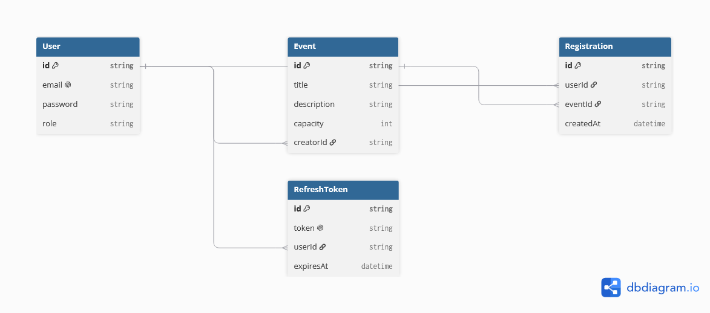

# Multi-Resource API with Roles & Concurrency Safety

A secure backend API for an event registration platform. Built with Node.js, Express, Prisma, and PostgreSQL (Neon).

## 🚀 Features
- **Role-Based Access Control (RBAC):** Admins can create events; Members can view and register.
- **Secure Authentication:** Short-lived Access Tokens (15m) + database-backed Refresh Tokens (7d).
- **Relational Schema:** Users, Events, Registrations, and Refresh Tokens using Foreign Keys.
- **Pagination & Sorting:** `GET /api/events` supports `page`, `limit`, `sortBy`, and `order`.
- **Concurrency Safety:** Utilizes PostgreSQL row-level locking (`FOR UPDATE`) inside a transaction to prevent race conditions during event registration.
- **Automated Testing:** 3 integration tests covering Auth, RBAC, and Concurrency using Jest & Supertest.

## 🛠️ Tech Stack
- **Runtime:** Node.js
- **Framework:** Express.js
- **Database:** PostgreSQL (hosted on Neon)
- **ORM:** Prisma
- **Testing:** Jest, Supertest

## 🗄️ Database Schema


- **User:** Stores credentials and role (ADMIN/MEMBER).
- **Event:** Stores event details and capacity.
- **Registration:** Join table linking Users and Events. Has a `@@unique([userId, eventId])` constraint.
- **RefreshToken:** Stores valid refresh tokens for token rotation.

## ⚙️ Setup & Installation
1. Clone the repository.
2. Install dependencies: `npm install`
3. Create a `.env` file in the root directory and add:
   ```env
   PORT=3000
   DATABASE_URL="your_neon_postgres_url"
   JWT_ACCESS_SECRET="your_access_secret"
   JWT_REFRESH_SECRET="your_refresh_secret"